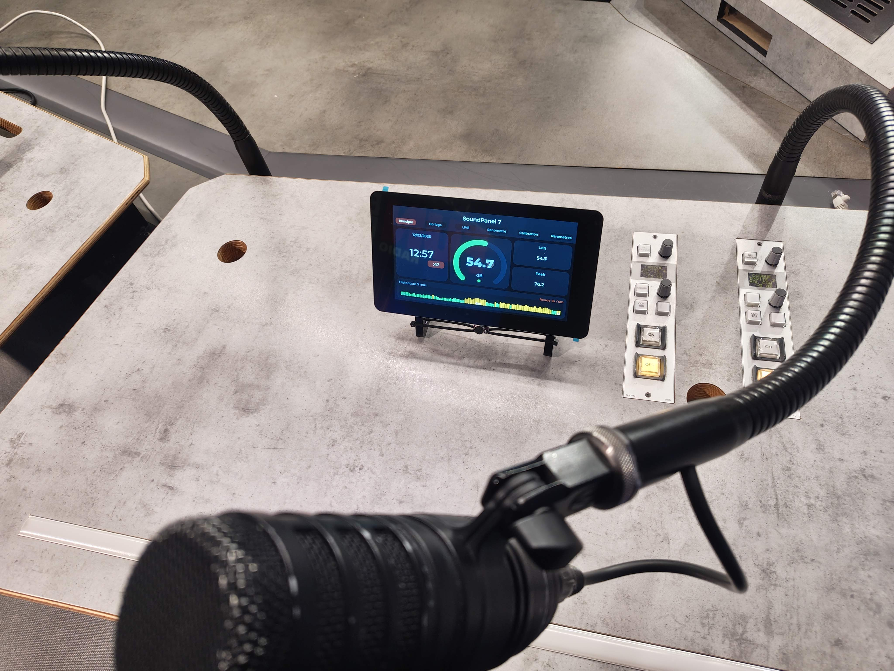
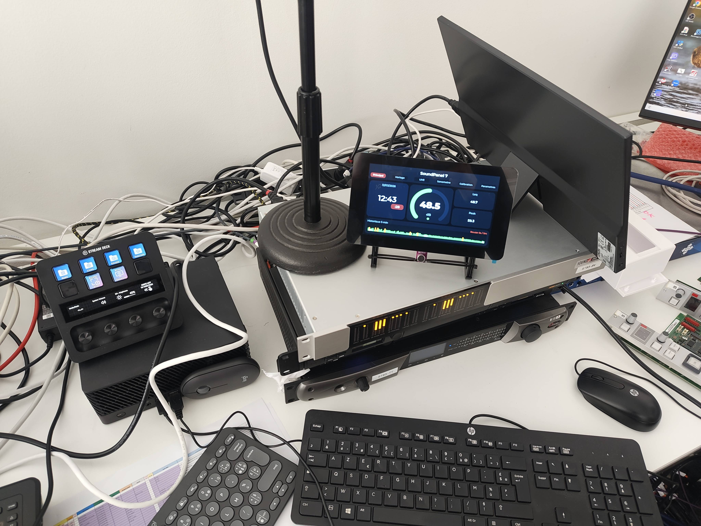
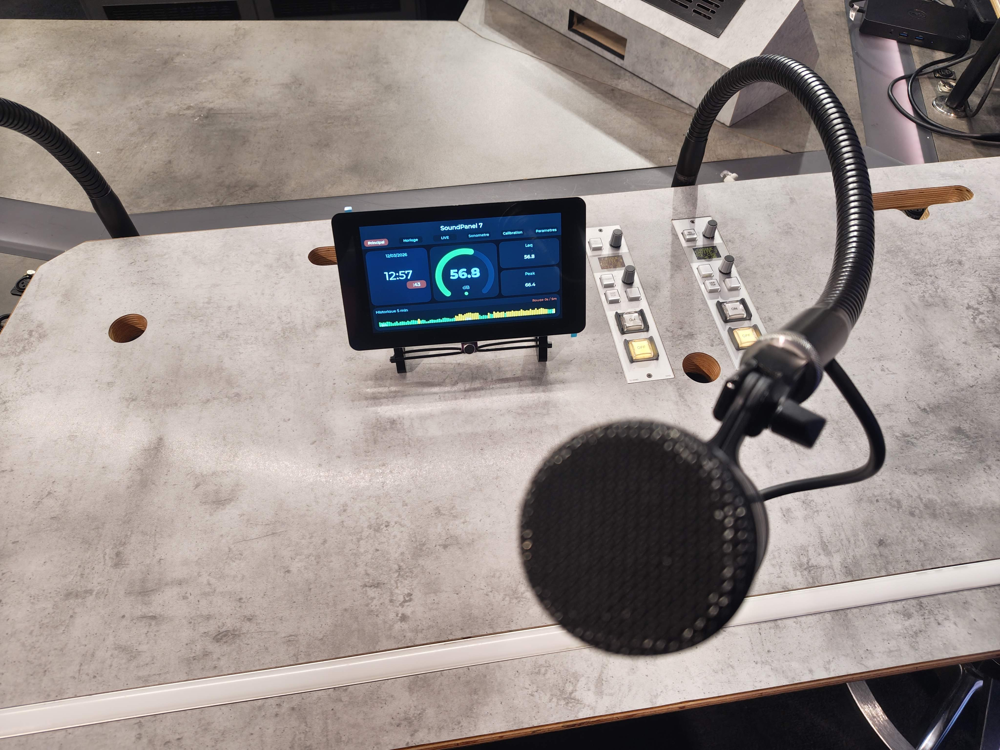
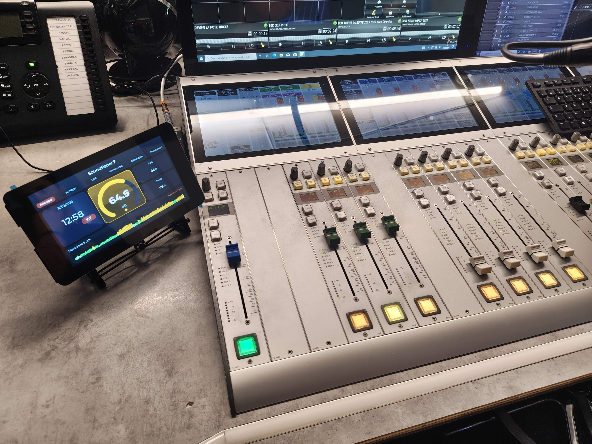
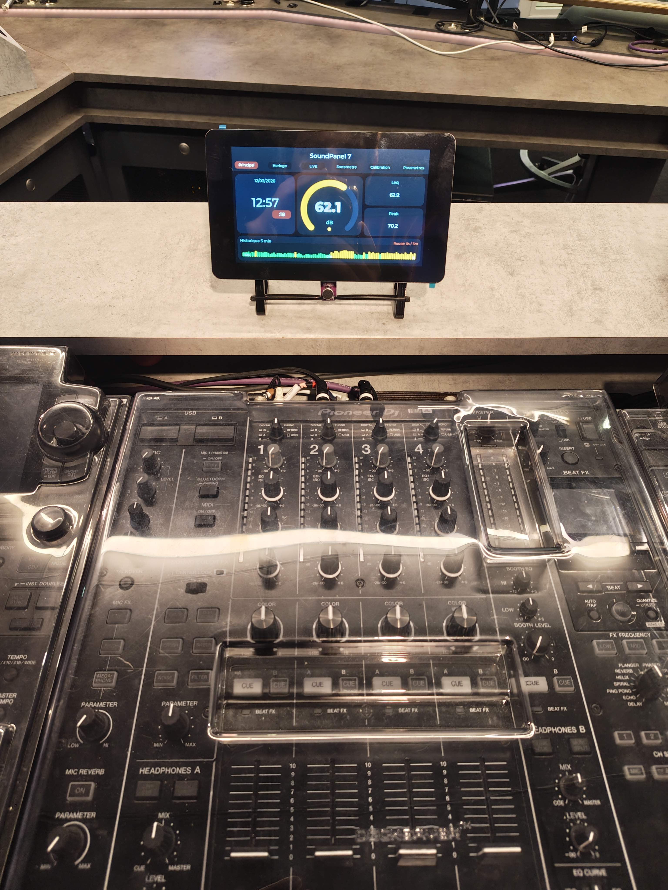
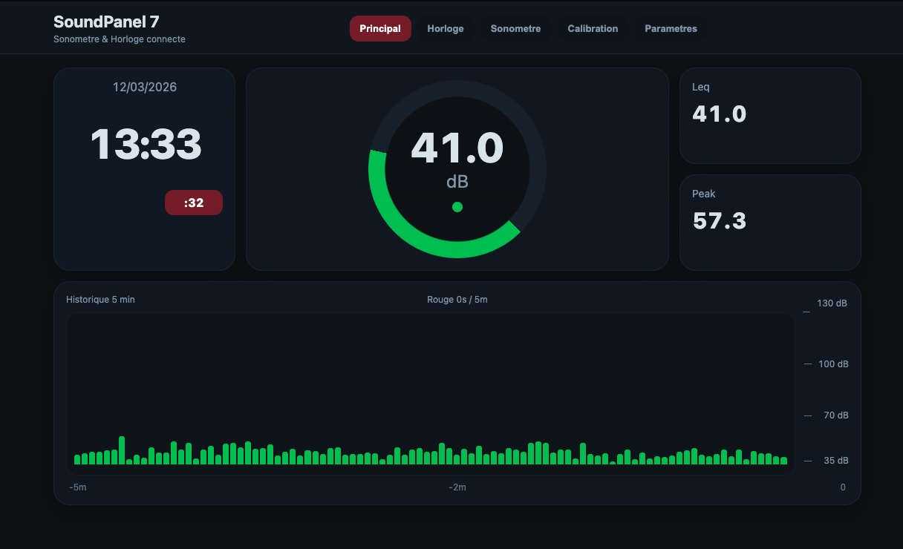
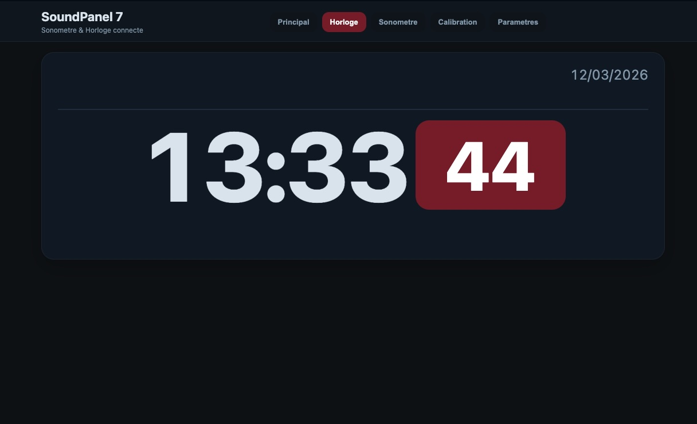
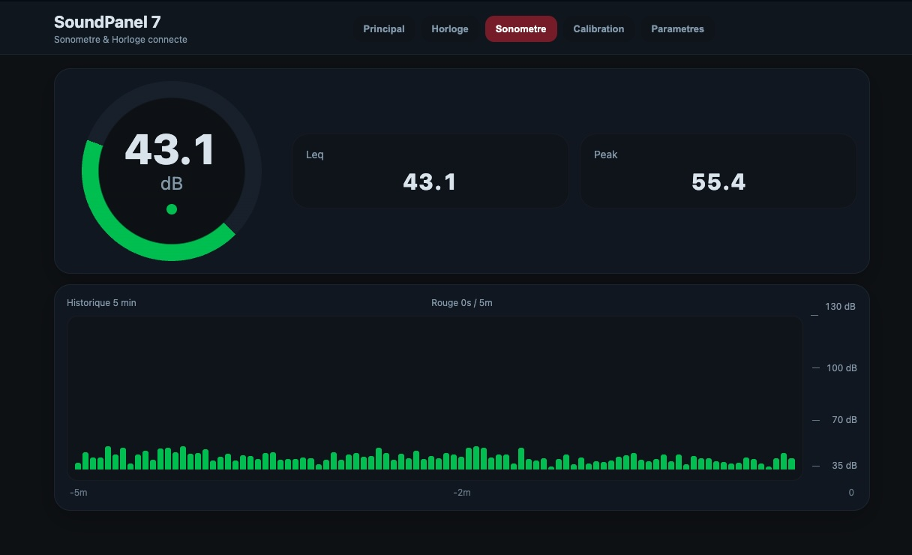
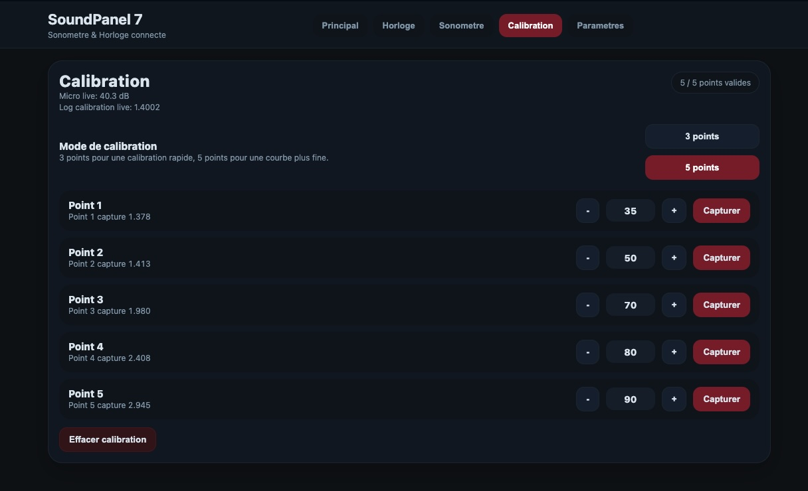
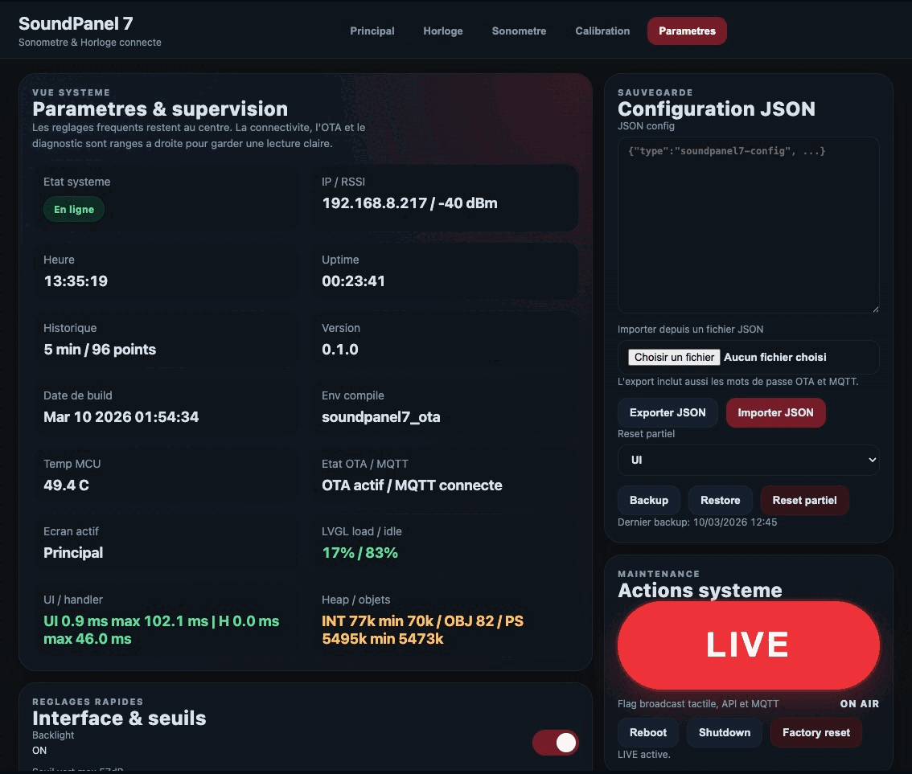

# 🎚️ SoundPanel 7

<p align="center">
  <strong>A connected wall panel for sound awareness, precision time, and calm workspaces.</strong>
</p>

<p align="center">
  Built on ESP32-S3 with a 7" touchscreen, real-time sound monitoring, NTP clock, web UI, MQTT, OTA, and Home Assistant integration.
</p>

<p align="center">
  
</p>

<p align="center">
  <a href="#francais">Francais</a> ·
  <a href="#english">English</a>
</p>

---

## Navigation

- [🇫🇷 Aller a la version francaise](#francais)
- [🇬🇧 Go to the English version](#english)

---

<a id="francais" name="francais"></a>

## 🇫🇷 Francais

### Menu Francais

- [Vision](#fr-vision)
- [Apercu visuel](#fr-apercu-visuel)
- [Points forts](#fr-points-forts)
- [Cas d'usage](#fr-cas-dusage)
- [Fonctionnalites](#fr-fonctionnalites)
- [Materiel cible](#fr-materiel-cible)
- [Demarrage rapide](#fr-demarrage-rapide)
- [Configuration par defaut](#fr-configuration-par-defaut)
- [Interface web](#fr-interface-web)
- [Horloge NTP](#fr-horloge-ntp)
- [MQTT](#fr-mqtt)
- [Home Assistant](#fr-home-assistant)
- [OTA](#fr-ota)
- [Calibration](#fr-calibration)
- [Architecture](#fr-architecture)
- [Arborescence](#fr-arborescence)
- [Etat du projet](#fr-etat-du-projet)
- [Contribution](#fr-contribution)

<a id="fr-vision"></a>

### ✨ Vision

SoundPanel 7 est un panneau mural connecte qui rend plusieurs informations visibles en un coup d'oeil :

- le niveau sonore ambiant
- l'heure reseau synchronisee a la seconde
- l'etat local du panneau, du Wi-Fi et des services

L'idee de depart etait tres simple.
Je travaille dans un open space trop bruyant, et je voulais un outil de **pedagogie douce** :
quelque chose de visible, factuel, elegant, et suffisamment clair
pour faire baisser naturellement le volume sans transformer l'espace
en salle de classe.

De la est nee une idee plus large :
un panneau autonome, lisible de loin, utile au bureau comme en regie,
en studio, en podcast, en atelier ou sur un plateau.

SoundPanel 7 n'est donc pas seulement un sonometre.
C'est un vrai **panneau d'ambiance et de supervision locale**,
capable d'afficher le son, le temps, l'etat reseau,
des diagnostics systeme, et de s'integrer proprement
dans un environnement connecte.

<a id="fr-apercu-visuel"></a>

### 📸 Apercu visuel

Avant les details techniques, voici le projet dans ses contextes reels :
en labo, en studio, et en usage quotidien.

<p align="center">
  
</p>

<p align="center">
  
  
</p>

<p align="center">
  
  
</p>

<a id="fr-points-forts"></a>

### 🚀 Points forts

- Grand affichage tactile 7" lisible a distance
- Mesure sonore en temps reel avec **dB instantane**, **Leq** et **Peak**
- **Grande horloge NTP** avec secondes visibles
- Interface locale LVGL en **5 pages** : overview, clock, sound, calibration, settings
- Interface web embarquee avec supervision live et administration
- Publication **MQTT** avec auto-reconnexion et MQTT Discovery
- **Home Assistant** via MQTT Discovery ou integration native
- Mises a jour **OTA**
- Stockage persistant des reglages avec **export / import / backup / restore**

<a id="fr-cas-dusage"></a>

### 🎯 Cas d'usage

- Open space trop bruyant : rendre le niveau sonore visible sans agressivite
- Studio d'enregistrement : garder les niveaux et l'heure sous les yeux
- Regie ou diffusion : afficher une heure reseau fiable avec secondes
- Podcast ou voix off : suivre un top horaire ou un timing de prise
- Atelier ou lieu public : afficher un indicateur simple, comprehensible par tous
- Domotique personnelle : ajouter un panneau mural utile, pas juste decoratif

<a id="fr-fonctionnalites"></a>

### 🧩 Fonctionnalites

#### 🔊 Monitoring sonore

- mesure continue du niveau sonore
- calcul du **Leq**
- calcul du **Peak**
- seuils visuels configurables
- historique glissant configurable
- mode de reponse **Fast** ou **Slow**
- maintien du peak configurable
- calibration micro en **3 ou 5 points**
- duree de capture de calibration configurable

#### 🕒 Horloge et synchronisation

- horloge grand format affichee en permanence
- affichage des **secondes** pour les usages de diffusion, prise et synchro
- synchronisation automatique via **NTP**
- configuration du serveur NTP, de la timezone et de l'intervalle de synchro
- statut de synchronisation visible dans l'UI et dans l'API

#### 🖥️ Interface locale

- pilotage tactile sur ecran 7"
- lecture immediate des niveaux et de l'heure
- consultation d'informations systeme
- extinction de l'ecran et **shutdown** depuis l'interface
- usage autonome sans navigateur

#### 🌐 Interface web

- page de statut temps reel
- page d'administration
- configuration UI, NTP, OTA, MQTT et reseau
- calibration depuis le navigateur
- flux live **SSE** sur le port `81`
- export / import de configuration
- backup / restore de configuration
- reset partiel par section : `ui`, `time`, `audio`, `calibration`, `ota`, `mqtt`
- actions systeme : reboot, shutdown, reset usine

#### 📡 Connectivite

- Wi-Fi via portail de configuration
- mDNS / Zeroconf : `_soundpanel7._tcp.local.`
- MQTT
- MQTT Discovery pour Home Assistant
- integration Home Assistant native via Zeroconf/mDNS
- OTA via `espota`

#### 🩺 Diagnostic

- uptime
- temperature MCU
- version firmware
- environnement de build
- etat OTA / MQTT
- charge LVGL, timings UI, heap interne / PSRAM
- nombre d'objets LVGL
- timestamp du dernier backup

<a id="fr-materiel-cible"></a>

### 🛠️ Materiel cible

#### 🧠 Carte principale

- **Waveshare ESP32-S3-Touch-LCD-7**
- ecran tactile 7"
- ESP32-S3
- Wi-Fi
- PSRAM
- USB
- retroeclairage pilotable

#### 🎤 Entree audio

Le firmware est pense pour un **micro analogique** branche sur l'entree capteur.

Exemples compatibles cites dans le projet :

- `MAX4466`
- `MAX9814`
- equivalent analogique

Par defaut, le projet compile avec un **mode audio mock** pour faciliter le developpement.

Dans [`platformio.ini`](platformio.ini), le flag suivant est actif par defaut :

```ini
-DSOUNDPANEL7_MOCK_AUDIO=1
```

Si tu branches une vraie entree analogique, verifie ce point avant d'evaluer le comportement du panneau.

<a id="fr-demarrage-rapide"></a>

### ⚡ Demarrage rapide

#### 1. Cloner le depot

```bash
git clone https://github.com/jjtronics/SoundPanel7.git
cd SoundPanel7
```

#### 2. Preparer l'environnement

Le plus simple :

- **VS Code**
- extension **PlatformIO**

Tu peux aussi utiliser `pio` en ligne de commande si PlatformIO Core est deja installe.

#### 3. Compiler

```bash
pio run
```

#### 4. Flasher en USB

L'environnement par defaut est `soundpanel7_usb`.

```bash
pio run -e soundpanel7_usb -t upload
```

#### 5. Ouvrir le moniteur serie

```bash
pio device monitor -b 115200
```

#### 6. Mettre a jour en OTA

Quand l'OTA est configuree sur l'appareil :

```bash
pio run -e soundpanel7_ota -t upload
```

Pense a ajuster dans [`platformio.ini`](platformio.ini) :

- `upload_port`
- `monitor_port`
- le mot de passe OTA si utilise

Au boot, le firmware initialise successivement :

1. le stockage des reglages
2. l'affichage et le tactile
3. le reseau
4. l'OTA
5. le MQTT
6. l'interface web
7. le moteur audio

<a id="fr-configuration-par-defaut"></a>

### ⚙️ Configuration par defaut

Valeurs actuelles du firmware :

- hostname : `soundpanel7`
- serveur NTP : `fr.pool.ntp.org`
- timezone POSIX : `CET-1CEST,M3.5.0/2,M10.5.0/3`
- intervalle NTP : `180 min`
- OTA activee : `oui`
- port OTA : `3232`
- MQTT active : `non`
- topic MQTT de base : `soundpanel7`
- pin analogique : `GPIO6`
- source audio par defaut : capteur analogique
- fenetre RMS analogique : `256 samples`
- reponse audio par defaut : `Fast`
- peak hold : `5000 ms`
- calibration par defaut : `3 points`, capture `3 s`

Ces reglages sont definis dans [`src/SettingsStore.h`](src/SettingsStore.h).

<a id="fr-interface-web"></a>

### 🌐 Interface web

Une fois l'appareil connecte au Wi-Fi :

- `http://IP_DU_SOUNDPANEL/`
- `http://soundpanel7.local/` si le mDNS est disponible
- flux live : `http://IP_DU_SOUNDPANEL:81/api/events`

#### Apercu des dashboards

<p align="center">
  
  
</p>

<p align="center">
  
  
</p>

L'interface permet notamment de regler :

- luminosite
- seuils de couleur
- duree d'historique
- mode de reponse audio
- duree des alertes orange / rouge
- NTP, timezone, intervalle de synchro et hostname
- parametres OTA
- parametres MQTT
- calibration micro
- backup / restore / import / export des reglages

#### Zone Parametres

Animation complete des reglages :

<p align="center">
  
</p>

Endpoints principaux exposes par le firmware :

```text
GET   /api/status
POST  /api/ui
GET   /api/time
POST  /api/time
GET   /api/config/export
POST  /api/config/import
POST  /api/config/backup
POST  /api/config/restore
POST  /api/config/reset_partial
GET   /api/ota
POST  /api/ota
GET   /api/mqtt
POST  /api/mqtt
POST  /api/calibrate
POST  /api/calibrate/clear
POST  /api/calibrate/mode
POST  /api/reboot
POST  /api/shutdown
POST  /api/factory_reset
```

Le `GET /api/status` renvoie notamment :

- dB, Leq, Peak
- historique glissant
- uptime
- statut Wi-Fi, IP et RSSI
- etat NTP / heure courante
- temperature MCU
- version firmware et environnement de build
- etat OTA / MQTT
- stats runtime LVGL / heap

<a id="fr-horloge-ntp"></a>

### 🕒 Horloge NTP

SoundPanel 7 est aussi une **grande horloge reseau**.

C'est un vrai usage, pas un gadget.
Dans un studio, une regie, un espace podcast ou un environnement de diffusion,
avoir une heure fiable avec les secondes en grand est aussi utile que l'affichage du niveau sonore.

Le firmware gere :

- la synchronisation NTP automatique
- le parametrage du serveur NTP
- la timezone POSIX
- l'intervalle de resynchronisation
- l'affichage local `HH:MM` avec badge secondes
- l'heure complete cote interface web

Par defaut, le serveur NTP configure est `fr.pool.ntp.org`.

<a id="fr-mqtt"></a>

### 📶 MQTT

Le panneau peut publier ses mesures vers un broker MQTT.

Parametres disponibles :

- host
- port
- username / password
- client ID
- topic racine
- intervalle de publication
- retain

Topics effectivement publies :

```text
soundpanel7/availability
soundpanel7/state
soundpanel7/db
soundpanel7/leq
soundpanel7/peak
soundpanel7/wifi/rssi
soundpanel7/wifi/ip
```

Avec **MQTT Discovery**, le firmware publie automatiquement les entites Home Assistant suivantes :

- `dB Instant`
- `Leq`
- `Peak`
- `WiFi RSSI`
- `WiFi IP`

<a id="fr-home-assistant"></a>

### 🏠 Home Assistant

Deux approches sont proposees.

#### Option 1 : MQTT Discovery

La plus simple si Home Assistant utilise deja MQTT.

Tu actives MQTT sur le SoundPanel 7, tu renseignes le broker, et les entites sont creees automatiquement.

#### Option 2 : integration native Home Assistant

Une integration custom est fournie dans :

[`custom_components/soundpanel7`](custom_components/soundpanel7)

Le firmware annonce le service :

```text
_soundpanel7._tcp.local.
```

L'integration interroge ensuite l'API HTTP du panneau, notamment `/api/status`.

Capteurs exposes par l'integration native :

- `dB Instant`
- `Leq`
- `Peak`
- `WiFi RSSI`
- `WiFi IP`
- `Uptime`

##### Installation

Copier `custom_components/soundpanel7` dans le dossier de configuration Home Assistant :

```text
config/custom_components/soundpanel7
```

Exemple :

```bash
mkdir -p /config/custom_components
cp -R custom_components/soundpanel7 /config/custom_components/
```

Puis :

1. redemarrer Home Assistant
2. redemarrer le SoundPanel 7
3. ouvrir `Parametres > Appareils et services`
4. attendre la decouverte automatique

Si rien n'apparait, verifier en priorite :

- que Home Assistant et le panneau sont sur le meme reseau
- que `manifest.json` est bien present cote Home Assistant
- que le panneau repond bien sur son interface web
- que le mDNS n'est pas perturbe par le reseau ou les VLANs

<a id="fr-ota"></a>

### 🚀 OTA

Quand l'OTA est configuree et activee sur l'appareil :

```bash
pio run -e soundpanel7_ota -t upload
```

L'environnement OTA de [`platformio.ini`](platformio.ini) repose sur :

- `upload_protocol = espota`
- port par defaut `3232`
- mot de passe OTA configurable

Pense a ajuster `upload_port` a l'adresse IP reelle de ton appareil.

<a id="fr-calibration"></a>

### 🎚️ Calibration

Le systeme de calibration fonctionne en **3 ou 5 points**.

Procedure recommandee :

1. placer un sonometre de reference a cote du SoundPanel 7
2. generer ou mesurer un niveau stable
3. saisir la valeur reelle
4. capturer les points de reference

Valeurs typiques utiles en mode 3 points :

- `45 dB`
- `65 dB`
- `85 dB`

Le firmware permet aussi :

- de choisir le mode `3 points` ou `5 points`
- de regler la duree de capture
- d'effacer la calibration
- de conserver des offsets de secours dans la configuration

Le firmware stocke ensuite les points et corrige la lecture.

#### Validation avec sonometre de reference

Une video de demonstration montre le SoundPanel 7 a cote d'un vrai sonometre professionnel,
pendant une montee progressive de bruit blanc, afin de verifier que les mesures restent coherentes.

[Voir la video de validation](MEDIAS/HARDWARE/SoundPanel7-APPART_1.mp4)

<a id="fr-architecture"></a>

### 🧠 Architecture

Le coeur du projet reste volontairement simple :

```text
AudioEngine -> SharedHistory -> UI / Web / MQTT
                  |
                  -> stockage et restitution des mesures
```

Composants principaux :

- [`src/main.cpp`](src/main.cpp) : orchestration globale
- [`src/AudioEngine.cpp`](src/AudioEngine.cpp) : acquisition et calculs audio
- [`src/ui/UiManager.cpp`](src/ui/UiManager.cpp) : interface LVGL
- [`src/WebManager.cpp`](src/WebManager.cpp) : HTTP, admin, live view, API
- [`src/MqttManager.cpp`](src/MqttManager.cpp) : MQTT et discovery
- [`src/OtaManager.cpp`](src/OtaManager.cpp) : OTA
- [`src/SettingsStore.cpp`](src/SettingsStore.cpp) : persistance NVS

<a id="fr-arborescence"></a>

### 📁 Arborescence

```text
.
├── src/                       Firmware principal
├── custom_components/         Integration Home Assistant
├── include/                   Headers partages
├── assets/                    Polices
└── platformio.ini             Build, flash et environnements
```

<a id="fr-etat-du-projet"></a>

### 🔧 Etat du projet

Le projet est deja exploitable, mais reste evolutif :

- la chaine audio depend encore beaucoup du capteur analogique reel
- le rendu final depend de la calibration
- certains parametres de `platformio.ini` sont ajustes pour la machine de dev actuelle
- la documentation hardware et cablage peut encore etre enrichie

En clair : c'est un projet serieux, vivant, et deja tres utile.

<a id="fr-contribution"></a>

### 🤝 Contribution

Les contributions sont bienvenues, surtout sur :

- documentation
- guide hardware et cablage
- calibration
- UX de l'interface
- integration et fiabilite reseau

Point d'entree recommande :

1. compiler
2. flasher
3. valider l'affichage local
4. tester l'interface web
5. tester MQTT, OTA et Home Assistant

---

<a id="english" name="english"></a>

## 🇬🇧 English

### English Menu

- [Overview](#en-overview)
- [Visual tour](#en-visual-tour)
- [Key features](#en-key-features)
- [Use cases](#en-use-cases)
- [Features](#en-features)
- [Hardware target](#en-hardware-target)
- [Quick start](#en-quick-start)
- [Default configuration](#en-default-configuration)
- [Web interface](#en-web-interface)
- [NTP clock](#en-ntp-clock)
- [MQTT and Home Assistant](#en-mqtt-and-home-assistant)
- [OTA updates](#en-ota-updates)
- [Calibration workflow](#en-calibration-workflow)
- [Firmware architecture](#en-firmware-architecture)
- [Project layout](#en-project-layout)
- [Project status](#en-project-status)
- [License](#en-license)

<a id="en-overview"></a>

### ✨ Overview

SoundPanel 7 is a connected wall panel that makes several things instantly visible:

- ambient sound level
- network-synchronized time down to the second
- local device, Wi-Fi, and service status

The original idea came from a very practical problem:
the open space where I work was simply too noisy.

Instead of policing people or constantly asking coworkers to lower their voices,
the goal was to build a **gentle awareness tool**:
something visible, factual, calm, and elegant enough to blend into a real workspace.

From there, the concept naturally expanded into a broader device:
a standalone panel that stays on, remains readable from a distance,
and works just as well in an office as it does in a control room,
recording studio, podcast setup, workshop, or public-facing space.

SoundPanel 7 is not just a sound meter.
It is a **local monitoring panel** for sound, time, network visibility,
runtime diagnostics, and connected integration.

<a id="en-visual-tour"></a>

### 📸 Visual tour

Before getting into firmware and integration details, here is the project in real environments:
lab space, recording studio, and day-to-day use.

<p align="center">
  
</p>

<p align="center">
  
  
</p>

<p align="center">
  
  
</p>

<a id="en-key-features"></a>

### 🚀 Key features

- Large 7" touchscreen display readable from a distance
- Real-time sound monitoring with **instant dB**, **Leq**, and **Peak**
- **Large NTP clock** with visible seconds
- Local LVGL UI with **5 pages**: overview, clock, sound, calibration, settings
- Embedded web interface with live monitoring and administration
- **MQTT** publishing with auto reconnect and Discovery
- **Home Assistant** through MQTT Discovery or native custom integration
- **OTA** firmware updates
- Persistent settings storage with **export / import / backup / restore**

<a id="en-use-cases"></a>

### 🎯 Use cases

- Noisy open space: make sound levels visible without turning into the noise police
- Recording studio: keep both sound level and precise time in view
- Broadcast or control room: display reliable network time with seconds
- Podcast or voice booth: follow timing and on-air references
- Workshop or public space: show a simple, readable ambient indicator
- Smart home wall panel: useful information, not just decoration

<a id="en-features"></a>

### 🧩 Features

#### 🔊 Sound monitoring

- continuous sound level measurement
- **Leq** calculation
- **Peak** calculation
- configurable visual thresholds
- configurable rolling history
- **Fast** or **Slow** response mode
- configurable peak hold
- microphone calibration in **3 or 5 points**
- configurable calibration capture duration

#### 🕒 Clock and synchronization

- always-visible large clock
- visible **seconds** for broadcast, recording, and sync use cases
- automatic **NTP** synchronization
- configurable NTP server, timezone, and sync interval
- sync status visible in the UI and the API

#### 🖥️ Local interface

- direct touch control on the 7" panel
- immediate reading of sound levels and time
- access to local system information
- screen off and **shutdown** from the interface
- fully usable without a browser

#### 🌐 Web interface

- real-time status page
- administration page
- UI, NTP, OTA, MQTT, and network configuration
- browser-based calibration
- live **SSE** stream on port `81`
- config export / import
- config backup / restore
- partial reset by scope: `ui`, `time`, `audio`, `calibration`, `ota`, `mqtt`
- system actions: reboot, shutdown, factory reset

#### 📡 Connectivity

- Wi-Fi through configuration portal
- mDNS / Zeroconf: `_soundpanel7._tcp.local.`
- MQTT
- MQTT Discovery for Home Assistant
- native Home Assistant integration through Zeroconf/mDNS
- OTA through `espota`

#### 🩺 Diagnostics

- uptime
- MCU temperature
- firmware version
- build environment
- OTA / MQTT state
- LVGL load, UI timings, internal heap / PSRAM
- LVGL object count
- last backup timestamp

<a id="en-hardware-target"></a>

### 🛠️ Hardware target

#### 🧠 Main board

- **Waveshare ESP32-S3-Touch-LCD-7**
- 7" touchscreen
- ESP32-S3
- Wi-Fi
- PSRAM
- USB
- controllable backlight

#### 🎤 Audio input

The firmware is designed around an **analog microphone** connected to the sensor input.

Examples referenced in the project:

- `MAX4466`
- `MAX9814`
- similar analog microphone modules

By default, the project builds with a **mock audio mode** to make development easier without a real measurement chain.

In [`platformio.ini`](platformio.ini), this flag is enabled by default:

```ini
-DSOUNDPANEL7_MOCK_AUDIO=1
```

If you connect a real analog input, check that setting first before judging the panel's behavior.

<a id="en-quick-start"></a>

### ⚡ Quick start

#### 1. Clone the repository

```bash
git clone https://github.com/jjtronics/SoundPanel7.git
cd SoundPanel7
```

#### 2. Prepare the environment

The easiest setup is:

- **VS Code**
- **PlatformIO** extension

You can also use the `pio` CLI if PlatformIO Core is already installed.

#### 3. Build

```bash
pio run
```

#### 4. Flash over USB

The default environment is `soundpanel7_usb`.

```bash
pio run -e soundpanel7_usb -t upload
```

#### 5. Open the serial monitor

```bash
pio device monitor -b 115200
```

#### 6. Update over OTA

Once OTA is configured on the device:

```bash
pio run -e soundpanel7_ota -t upload
```

Remember to adjust in [`platformio.ini`](platformio.ini):

- `upload_port`
- `monitor_port`
- OTA password if used

At boot, the firmware initializes:

1. settings storage
2. display and touch
3. networking
4. OTA
5. MQTT
6. web interface
7. audio engine

<a id="en-default-configuration"></a>

### ⚙️ Default configuration

Current firmware defaults:

- hostname: `soundpanel7`
- NTP server: `fr.pool.ntp.org`
- POSIX timezone: `CET-1CEST,M3.5.0/2,M10.5.0/3`
- NTP sync interval: `180 min`
- OTA enabled: `yes`
- OTA port: `3232`
- MQTT enabled: `no`
- MQTT base topic: `soundpanel7`
- analog pin: `GPIO6`
- default audio source: analog sensor
- analog RMS window: `256 samples`
- default audio response: `Fast`
- peak hold: `5000 ms`
- default calibration: `3 points`, `3 s` capture

These settings are defined in [`src/SettingsStore.h`](src/SettingsStore.h).

<a id="en-web-interface"></a>

### 🌐 Web interface

Once the device is connected to Wi-Fi:

- `http://DEVICE_IP/`
- `http://soundpanel7.local/` if mDNS is available
- live stream: `http://DEVICE_IP:81/api/events`

#### Dashboard overview

<p align="center">
  
  
</p>

<p align="center">
  
  
</p>

The interface lets you configure:

- brightness
- color thresholds
- history duration
- audio response mode
- orange / red alert hold time
- NTP, timezone, sync interval, and hostname
- OTA settings
- MQTT settings
- microphone calibration
- backup / restore / import / export of settings

#### Settings flow

Animated walkthrough of the settings area:

<p align="center">
  
</p>

Main endpoints exposed by the firmware:

```text
GET   /api/status
POST  /api/ui
GET   /api/time
POST  /api/time
GET   /api/config/export
POST  /api/config/import
POST  /api/config/backup
POST  /api/config/restore
POST  /api/config/reset_partial
GET   /api/ota
POST  /api/ota
GET   /api/mqtt
POST  /api/mqtt
POST  /api/calibrate
POST  /api/calibrate/clear
POST  /api/calibrate/mode
POST  /api/reboot
POST  /api/shutdown
POST  /api/factory_reset
```

`GET /api/status` includes:

- dB, Leq, Peak
- rolling history
- uptime
- Wi-Fi status, IP, and RSSI
- NTP state / current time
- MCU temperature
- firmware version and build environment
- OTA / MQTT state
- LVGL / heap runtime statistics

<a id="en-ntp-clock"></a>

### 🕒 NTP clock

SoundPanel 7 is also a **large network clock**.

That is not a cosmetic extra.
In a studio, control room, podcast environment, or broadcast workflow,
having reliable time with visible seconds is often just as useful as the sound reading itself.

The firmware handles:

- automatic NTP synchronization
- configurable NTP server
- POSIX timezone support
- configurable resync interval
- local `HH:MM` display with a seconds badge
- full time display in the web interface

The default NTP server is `fr.pool.ntp.org`.

<a id="en-mqtt-and-home-assistant"></a>

### 📶 MQTT and Home Assistant

The panel can publish its metrics to an MQTT broker.

Available settings:

- host
- port
- username / password
- client ID
- base topic
- publish interval
- retain

Published topics:

```text
soundpanel7/availability
soundpanel7/state
soundpanel7/db
soundpanel7/leq
soundpanel7/peak
soundpanel7/wifi/rssi
soundpanel7/wifi/ip
```

With **MQTT Discovery**, the firmware publishes these Home Assistant entities automatically:

- `dB Instant`
- `Leq`
- `Peak`
- `WiFi RSSI`
- `WiFi IP`

Home Assistant support is available in two ways.

#### Option 1: MQTT Discovery

If your Home Assistant setup already relies on MQTT, this is the quickest path.
Enable MQTT on the panel, configure the broker, and entities will be created automatically.

#### Option 2: Native Home Assistant integration

A custom integration is included in:

[`custom_components/soundpanel7`](custom_components/soundpanel7)

The firmware advertises:

```text
_soundpanel7._tcp.local.
```

The integration then queries the panel over HTTP, including `/api/status`.

Sensors exposed by the native integration:

- `dB Instant`
- `Leq`
- `Peak`
- `WiFi RSSI`
- `WiFi IP`
- `Uptime`

Installation example:

```bash
mkdir -p /config/custom_components
cp -R custom_components/soundpanel7 /config/custom_components/
```

After that:

1. restart Home Assistant
2. restart SoundPanel 7
3. open `Settings > Devices & Services`
4. wait for auto-discovery

If the device does not show up, check:

- same local network on both sides
- `manifest.json` correctly copied
- panel reachable through its web UI
- mDNS not blocked by network setup or VLAN segmentation

<a id="en-ota-updates"></a>

### 🚀 OTA updates

Once OTA is configured and enabled on the device:

```bash
pio run -e soundpanel7_ota -t upload
```

The OTA environment in [`platformio.ini`](platformio.ini) uses:

- `upload_protocol = espota`
- default port `3232`
- configurable OTA password

Remember to adjust `upload_port` to the real IP address of your device.

<a id="en-calibration-workflow"></a>

### 🎚️ Calibration workflow

The calibration system uses **3 or 5 reference points**.

Recommended process:

1. place a reference sound meter next to SoundPanel 7
2. generate or observe a stable sound level
3. enter the real measured value
4. capture the reference points

Typical useful values in 3-point mode:

- `45 dB`
- `65 dB`
- `85 dB`

The firmware also lets you:

- switch between `3-point` and `5-point` modes
- configure the capture duration
- clear the current calibration
- keep fallback offsets in settings

The firmware stores those points and applies the correction curve accordingly.

#### Reference meter validation

A short demo video shows SoundPanel 7 next to a professional sound level meter
while white noise is increased progressively, to confirm the readings stay aligned.

[Watch the measurement comparison video](MEDIAS/HARDWARE/SoundPanel7-APPART_1.mp4)

<a id="en-firmware-architecture"></a>

### 🧠 Firmware architecture

The core flow remains intentionally simple:

```text
AudioEngine -> SharedHistory -> UI / Web / MQTT
                  |
                  -> data storage and playback
```

Main components:

- [`src/main.cpp`](src/main.cpp): global orchestration
- [`src/AudioEngine.cpp`](src/AudioEngine.cpp): audio acquisition and calculations
- [`src/ui/UiManager.cpp`](src/ui/UiManager.cpp): LVGL interface
- [`src/WebManager.cpp`](src/WebManager.cpp): HTTP, admin, live view, API
- [`src/MqttManager.cpp`](src/MqttManager.cpp): MQTT publishing and discovery
- [`src/OtaManager.cpp`](src/OtaManager.cpp): OTA updates
- [`src/SettingsStore.cpp`](src/SettingsStore.cpp): NVS persistence

<a id="en-project-layout"></a>

### 📁 Project layout

```text
.
├── src/                       Main firmware
├── custom_components/         Home Assistant integration
├── include/                   Shared headers
├── assets/                    Fonts
└── platformio.ini             Build, flash, and environments
```

<a id="en-project-status"></a>

### 🔧 Project status

The project is already useful and operational, but still evolving:

- the audio chain still depends heavily on the real analog sensor hardware
- final accuracy depends on calibration quality
- some `platformio.ini` values are tuned for the current development machine
- hardware and wiring documentation can still be expanded

In short: this is a serious project, a living one, and already a very practical tool.

<a id="en-license"></a>

## 📜 License

Open-source project.  
Add the final repository license here if you want the README to state it explicitly.
