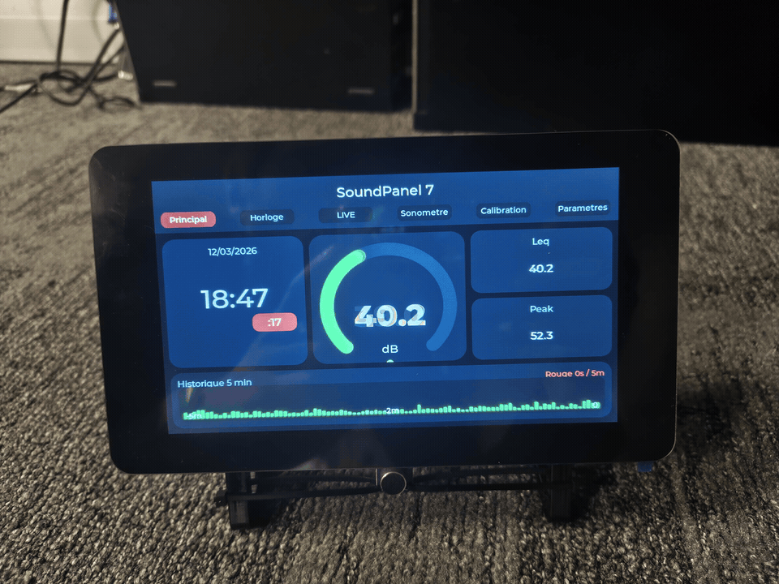
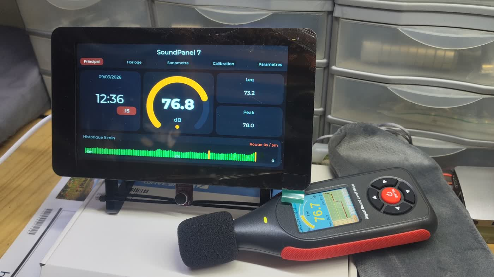

# 🎚️ SoundPanel 7

<p align="center">
  <strong>A connected wall panel for sound awareness, precision timing, and calm workspaces.</strong>
</p>

<p align="center">
  Built on ESP32-S3 with a 7" touchscreen for real-time dB monitoring, a large NTP clock, web administration, MQTT, OTA, and Home Assistant integration.
</p>

<p align="center">
  
  
  
  
  
  
  
</p>

<p align="center">
  
</p>

<p align="center">
  <em>Animated preview of the on-device dashboards: principal view, clock, LIVE mode, sound meter, PIN screen, calibration, and settings.</em>
</p>

<p align="center">
  
</p>

<p align="center">
  <em>Measured in real environments: lab, studio, and day-to-day workspace.</em>
</p>

<p align="center">
  <a href="#francais">Français</a> ·
  <a href="#english">English</a>
</p>

<p align="center">
  FR :
  <a href="#fr-apercu-visuel">Photos</a> ·
  <a href="#fr-interface-web">Web UI</a> ·
  <a href="#fr-demarrage-rapide">Démarrage</a> ·
  <a href="#fr-affichage-dashboard">Dashboard</a> ·
  <a href="#fr-notifications-sortantes">Notifications</a> ·
  <a href="#fr-home-assistant">Home Assistant</a> ·
  <a href="#fr-calibration">Calibration</a>
</p>

<p align="center">
  EN :
  <a href="#en-visual-tour">Visual Tour</a> ·
  <a href="#en-web-interface">Web UI</a> ·
  <a href="#en-quick-start">Quick Start</a> ·
  <a href="#en-dashboard-display">Dashboard</a> ·
  <a href="#en-outbound-alerting">Alerting</a> ·
  <a href="#en-mqtt-and-home-assistant">Home Assistant</a> ·
  <a href="#en-calibration-workflow">Calibration</a>
</p>

---

<a id="francais" name="francais"></a>

## 🇫🇷 Français

### Menu Français

- [Vision](#fr-vision)
- [Aperçu visuel](#fr-apercu-visuel)
- [Points forts](#fr-points-forts)
- [Cas d'usage](#fr-cas-dusage)
- [Fonctionnalités](#fr-fonctionnalites)
- [Matériel cible](#fr-materiel-cible)
- [Démarrage rapide](#fr-demarrage-rapide)
- [Configuration par défaut](#fr-configuration-par-defaut)
- [Interface web](#fr-interface-web)
- [Affichage du dashboard](#fr-affichage-dashboard)
- [Sécurité web et PIN](#fr-securite-web-pin)
- [Wi-Fi multi-AP](#fr-wifi-multi-ap)
- [Gestion de configuration](#fr-gestion-configuration)
- [Horloge NTP](#fr-horloge-ntp)
- [MQTT](#fr-mqtt)
- [Notifications sortantes](#fr-notifications-sortantes)
- [Home Assistant](#fr-home-assistant)
- [OTA](#fr-ota)
- [Calibration](#fr-calibration)
- [Architecture](#fr-architecture)
- [Arborescence](#fr-arborescence)
- [État du projet](#fr-etat-du-projet)
- [Contribution](#fr-contribution)

<a id="fr-vision"></a>

### ✨ Vision

SoundPanel 7 est un panneau mural connecté qui rend plusieurs informations visibles en un coup d'œil :

- le niveau sonore ambiant
- l'heure réseau synchronisée à la seconde
- l'état local du panneau, du Wi-Fi et des services

L'idée de départ était simple :
créer un outil de **pédagogie douce** pour rendre le bruit visible sans agressivité.

Le projet a ensuite évolué vers un panneau autonome, lisible de loin,
utile en open space, en studio, en régie, en podcast, en atelier ou sur un plateau.

SoundPanel 7 n'est donc pas seulement un sonomètre.
C'est un **panneau local de supervision** pour le son, le temps, le réseau et les intégrations connectées.

<a id="fr-apercu-visuel"></a>

### 📸 Aperçu visuel

Avant les détails techniques, voici le projet dans ses contextes réels :
en labo, en studio, et en usage quotidien.

<p align="center">
  
</p>

<p align="center">
  
  
</p>

<p align="center">
  
  
</p>

<a id="fr-points-forts"></a>

### 🚀 Points forts

- Grand affichage tactile 7" pour le bruit, l'heure et l'état du panneau
- Mesure sonore en temps réel avec **dB instantané**, **Leq** et **Peak**
- Grande horloge **NTP** avec secondes visibles, utile en studio comme en diffusion
- Double interface : écran local **LVGL** + interface web sécurisée
- Intégrations connectées : **MQTT**, MQTT Discovery, **Home Assistant**, **OTA**
- Réglages persistants avec export, import, backup et restore

<a id="fr-cas-dusage"></a>

### 🎯 Cas d'usage

- Open space trop bruyant : rendre le niveau sonore visible sans agressivité
- Studio d'enregistrement : garder les niveaux et l'heure sous les yeux
- Régie ou diffusion : afficher une heure réseau fiable avec secondes
- Podcast ou voix off : suivre un top horaire ou un timing de prise
- Soirée à la maison : garder un œil sur le volume quand les fêtards aiment le monter un peu trop fort
- Atelier ou lieu public : afficher un indicateur simple, compréhensible par tous dans le genre des panneaux LIVE devant les studios d'enregistrement
- Domotique personnelle : remonter les niveaux sonores pour traitement / exécution d'actions

<a id="fr-fonctionnalites"></a>

### 🧩 Fonctionnalités

#### 🔊 Monitoring sonore

- mesure continue du niveau sonore
- calcul du **Leq**
- calcul du **Peak**
- seuils visuels configurables
- historique glissant configurable
- mode de réponse **Fast** ou **Slow**
- maintien du peak configurable
- calibration micro en **3 ou 5 points**
- durée de capture de calibration configurable

#### 🕒 Horloge et synchronisation

- horloge grand format affichée en permanence
- affichage des **secondes** pour les usages de diffusion, prise et synchro
- synchronisation automatique via **NTP**
- configuration du serveur NTP, de la timezone et de l'intervalle de synchro
- statut de synchronisation visible dans l'UI et dans l'API

#### 🖥️ Interface locale

- pilotage tactile sur écran 7"
- lecture immédiate des niveaux et de l'heure
- consultation d'informations système
- extinction de l'écran et **shutdown** depuis l'interface
- protection par **PIN local** des pages sensibles (Calibration et Paramètres)
- usage autonome sans navigateur

#### 🌐 Interface web

- supervision temps réel et administration
- configuration UI, audio, Wi-Fi, NTP, OTA, MQTT et réseau
- calibration depuis le navigateur et pilotage du mode **LIVE**
- vérification et installation des releases firmware GitHub directement depuis l'interface web
- authentification web avec bootstrap du premier compte, gestion d'utilisateurs et sessions
- notifications sortantes via webhooks / API : Slack incoming webhook, Telegram Bot API, WhatsApp Cloud API, avec envoi de test
- flux live **SSE** sur le port `81`
- export / import / backup / restore de configuration
- reset partiel par section : `ui`, `time`, `audio`, `calibration`, `ota`, `mqtt`
- actions système : reboot, shutdown, reset usine

#### 📡 Connectivité

- Wi-Fi via portail de configuration
- mDNS / Zeroconf : `_soundpanel7._tcp.local.`
- MQTT
- MQTT Discovery pour Home Assistant
- contrôle du mode **LIVE** via Web UI, API et **MQTT**
- intégration Home Assistant native via Zeroconf/mDNS
- OTA via `espota`

#### 🩺 Diagnostic

- uptime
- température MCU
- version firmware
- environnement de build
- état OTA / MQTT
- charge LVGL, timings UI, heap interne / PSRAM
- nombre d'objets LVGL
- timestamp du dernier backup

<a id="fr-materiel-cible"></a>

### 🛠️ Matériel cible

#### 🧠 Carte principale

- **Waveshare ESP32-S3-Touch-LCD-7**
- écran tactile 7"
- ESP32-S3
- Wi-Fi
- Bluetooth
- rétroéclairage pilotable (On/Off)
- ...

#### 🎤 Entrée audio

Le firmware est pensé pour un **micro analogique** branché sur l'entrée capteur.

Exemples compatibles cités dans le projet :

- `MAX4466`
- équivalent analogique à **gain fixe**

Modèle à ne surtout pas utiliser :

- `MAX9814` : son gain automatique fausse la mesure pour ce projet

Par défaut, le projet compile avec un **mode audio mock** pour faciliter le développement.

Dans [`platformio.ini`](platformio.ini), le flag suivant est actif par défaut :

```ini
-DSOUNDPANEL7_MOCK_AUDIO=1
```

Si tu branches une vraie entrée analogique, vérifie ce point avant d'évaluer le comportement du panneau.

<a id="fr-demarrage-rapide"></a>

### ⚡ Démarrage rapide

#### 1. Cloner le dépôt

```bash
git clone https://github.com/jjtronics/SoundPanel7.git
cd SoundPanel7
```

#### 2. Préparer l'environnement

Le plus simple :

- **VS Code**
- extension **PlatformIO**

Tu peux aussi utiliser `pio` en ligne de commande si PlatformIO Core est déjà installé.

#### 3. Compiler

```bash
pio run
```

#### 4. Flasher en USB

L'environnement par défaut est `soundpanel7_usb`.

```bash
pio run -e soundpanel7_usb -t upload
```

#### 5. Ouvrir le moniteur série

```bash
pio device monitor -b 115200
```

#### 6. Mettre à jour en OTA

Quand l'OTA est configurée sur l'appareil :

```bash
pio run -e soundpanel7_ota -t upload
```

Les réglages locaux de machine et de réseau ne doivent pas être commités dans [`platformio.ini`](platformio.ini).
Utilise plutôt un fichier local `platformio.override.ini` ignoré par Git, par exemple à partir de [`platformio.override.example.ini`](platformio.override.example.ini).

Exemple :

```ini
[env:soundpanel7_usb]
upload_port = /dev/cu.usbmodemXXXX
monitor_port = /dev/cu.usbmodemXXXX

[env:soundpanel7_ota]
upload_port = 192.168.1.137
```

Alternative ponctuelle :

```bash
pio run -e soundpanel7_ota -t upload --upload-port 192.168.1.137
```

Vérifie aussi que le poste qui lance `espota` est sur le même réseau Wi-Fi que l'appareil.

Les valeurs locales typiques à surcharger sont :

- `upload_port` (son IP)
- `monitor_port`
- le mot de passe OTA si utilisé

Au boot, le firmware initialise successivement :

1. le stockage des réglages
2. l'affichage et le tactile
3. le réseau
4. l'OTA
5. le MQTT
6. l'interface web
7. le moteur audio

<a id="fr-configuration-par-defaut"></a>

### ⚙️ Configuration par défaut

Valeurs actuelles du firmware :

- hostname : `soundpanel7`
- serveur NTP : `fr.pool.ntp.org`
- timezone POSIX : `CET-1CEST,M3.5.0/2,M10.5.0/3`
- intervalle NTP : `180 min`
- OTA activée : `oui`
- port OTA : `3232`
- MQTT activé : `non`
- topic MQTT de base : `soundpanel7`
- pin analogique : `GPIO6`
- source audio par défaut : capteur analogique
- fenêtre RMS analogique : `256 samples`
- réponse audio par défaut : `Fast`
- peak hold : `5000 ms`
- calibration par défaut : `3 points`, capture `3 s`

Ces réglages sont définis dans [`src/SettingsStore.h`](src/SettingsStore.h).

<a id="fr-interface-web"></a>

### 🌐 Interface web

Une fois l'appareil connecté au Wi-Fi :

- `http://IP_DU_SOUNDPANEL/`
- `http://soundpanel7.local/` si le mDNS est disponible
- flux live : `http://IP_DU_SOUNDPANEL:81/api/events`

#### Aperçu des dashboards

<p align="center">
  
  
</p>

<p align="center">
  
  
</p>

L'interface permet notamment de régler :

- luminosité
- seuils de couleur
- durée d'historique
- mode de réponse audio
- durée des alertes orange / rouge
- mode LIVE et page d'ouverture par défaut
- contrôle de l'affichage du dashboard local : page affichée, tactile actif/inactif, mode plein écran sans menu du haut
- paramètres Wi-Fi
- NTP, timezone, intervalle de synchro et hostname
- paramètres OTA
- paramètres MQTT
- notifications sortantes : Slack incoming webhook, Telegram Bot API, WhatsApp Cloud API
- calibration micro
- PIN local d'accès
- comptes utilisateurs web
- backup / restore / import / export des réglages

#### Zone Paramètres

Animation complète des réglages :

<p align="center">
  
</p>

Endpoints principaux exposés par le firmware :

```text
GET   /api/auth/status
POST  /api/auth/login
POST  /api/auth/logout
POST  /api/auth/bootstrap
GET   /api/users
POST  /api/users/create
POST  /api/users/password
POST  /api/users/delete
GET   /api/homeassistant
POST  /api/homeassistant
GET   /api/ha/status
GET   /api/status
POST  /api/pin
POST  /api/ui
GET   /api/live
POST  /api/live
GET   /api/wifi
POST  /api/wifi
GET   /api/time
POST  /api/time
GET   /api/config/export
POST  /api/config/import
POST  /api/config/backup
POST  /api/config/restore
POST  /api/config/reset_partial
GET   /api/ota
POST  /api/ota
GET   /api/release
POST  /api/release/check
POST  /api/release/install
GET   /api/mqtt
POST  /api/mqtt
GET   /api/notifications
POST  /api/notifications
POST  /api/notifications/test
POST  /api/calibrate
POST  /api/calibrate/clear
POST  /api/calibrate/mode
POST  /api/reboot
POST  /api/shutdown
POST  /api/factory_reset
```

Le `GET /api/status` renvoie notamment :

- dB, Leq, Peak
- historique glissant
- uptime
- statut Wi-Fi, IP et RSSI
- état NTP / heure courante
- température MCU
- version firmware et environnement de build
- état OTA / MQTT
- état LIVE, PIN et calibration
- stats runtime LVGL / heap

<a id="fr-affichage-dashboard"></a>

### 🖥️ Affichage du dashboard

L'interface web permet aussi de piloter finement l'affichage du panneau tactile 7" :

- choisir la vue affichée : principal, horloge, LIVE ou sonomètre
- activer ou désactiver complètement le tactile
- activer un mode plein écran par vue pour masquer la barre du haut sur l'écran local
- appliquer ces changements immédiatement sans reflasher le firmware

Ces réglages sont sauvegardés via l'API UI du firmware et restent actifs après redémarrage.

<a id="fr-securite-web-pin"></a>

### 🔐 Sécurité web et PIN

Le projet combine deux niveaux de protection :

- authentification web avec création du premier compte au bootstrap
- gestion de comptes locaux avec changement de mot de passe et suppression d'utilisateur
- sessions web pour l'administration et l'accès au flux live
- code **PIN** local pour protéger les pages sensibles sur le panneau tactile

Endpoints associés :

```text
GET   /api/auth/status
POST  /api/auth/login
POST  /api/auth/logout
POST  /api/auth/bootstrap
GET   /api/users
POST  /api/users/create
POST  /api/users/password
POST  /api/users/delete
POST  /api/pin
```

<a id="fr-wifi-multi-ap"></a>

### 📡 Wi-Fi multi-AP

Le panneau peut mémoriser jusqu'à **4 réseaux Wi-Fi** pour s'adapter à plusieurs lieux d'usage :

- maison, bureau, studio, partage de connexion, etc.
- conservation du mot de passe déjà stocké si le champ reste vide
- prise en charge des réseaux ouverts si aucun mot de passe n'est renseigné
- état de connexion visible dans l'interface web

Endpoints associés :

```text
GET   /api/wifi
POST  /api/wifi
```

<a id="fr-gestion-configuration"></a>

### 💾 Gestion de configuration

Le firmware intègre une vraie gestion des réglages pour éviter de tout refaire à la main :

- export JSON complet de la configuration
- import de configuration depuis l'interface web
- backup local du dernier état connu
- restore du backup en un clic
- reset partiel par section : `ui`, `time`, `audio`, `calibration`, `ota`, `mqtt`
- horodatage du dernier backup visible dans le statut

Endpoints associés :

```text
GET   /api/config/export
POST  /api/config/import
POST  /api/config/backup
POST  /api/config/restore
POST  /api/config/reset_partial
```

<a id="fr-horloge-ntp"></a>

### 🕒 Horloge NTP

SoundPanel 7 fait aussi office de **grande horloge réseau**.
Dans un studio, une régie ou un setup podcast, avoir une heure fiable avec les secondes en grand est souvent aussi utile que la mesure sonore.

Le firmware gère :

- la synchronisation NTP automatique
- le paramétrage du serveur NTP
- la timezone POSIX
- l'intervalle de resynchronisation
- l'affichage local `HH:MM` avec badge secondes
- l'heure complète côté interface web

Par défaut, le serveur NTP configuré est `fr.pool.ntp.org`.

<a id="fr-mqtt"></a>

### 📶 MQTT

Le panneau peut publier ses mesures vers un broker MQTT.

Paramètres disponibles :

- host
- port
- username / password
- client ID
- topic racine
- intervalle de publication
- retain

Topics effectivement publiés :

```text
soundpanel7/availability
soundpanel7/state
soundpanel7/db
soundpanel7/leq
soundpanel7/peak
soundpanel7/live/state
soundpanel7/live/set
soundpanel7/wifi/rssi
soundpanel7/wifi/ip
```

Avec **MQTT Discovery**, le firmware publie automatiquement les entités Home Assistant suivantes :

- `dB Instant`
- `Leq`
- `Peak`
- `LIVE`
- `WiFi RSSI`
- `WiFi IP`

<a id="fr-notifications-sortantes"></a>

### 🚨 Notifications sortantes

Le panneau peut envoyer des alertes vers des services externes lorsqu'un seuil est dépassé ou lors du retour à la normale.

Canaux pris en charge :

- Slack via **incoming webhook**
- Telegram via **Bot API**
- WhatsApp via **Cloud API**

Fonctionnalités disponibles :

- notification des alertes `warning` et/ou `critique`
- notification optionnelle du retour à la normale
- résumé des cibles actives
- mémorisation du dernier résultat et du dernier succès
- envoi de test depuis l'interface web

Endpoints associés :

```text
GET   /api/notifications
POST  /api/notifications
POST  /api/notifications/test
```

<a id="fr-home-assistant"></a>

### 🏠 Home Assistant

Deux approches sont proposées :

#### Option 1 : MQTT Discovery

La plus simple si Home Assistant utilise déjà MQTT : tu actives MQTT sur le SoundPanel 7, tu renseignes le broker, et les entités sont créées automatiquement.

#### Option 2 : intégration native Home Assistant

Une intégration custom est fournie dans :

[`custom_components/soundpanel7`](custom_components/soundpanel7)

Le firmware annonce le service :

```text
_soundpanel7._tcp.local.
```

L'intégration interroge l'endpoint dédié `/api/ha/status` avec un bearer token Home Assistant.

Capteurs exposés par l'intégration native :

- `dB Instant`
- `Leq`
- `Peak`
- `WiFi RSSI`
- `WiFi IP`
- `Uptime`

##### Installation via HACS

Le dépôt peut maintenant être ajouté dans **HACS** comme **custom repository**.

Pré-requis :

- une release GitHub publiée (ex. `v0.1.0`)
- HACS installé dans Home Assistant

Étapes :

1. ouvrir `HACS > Integrations`
2. ouvrir le menu en haut à droite puis `Custom repositories`
3. ajouter `https://github.com/jjtronics/SoundPanel7`
4. choisir la catégorie `Integration`
5. rechercher `SoundPanel 7` dans HACS puis l'installer
6. redémarrer Home Assistant
7. redémarrer le SoundPanel 7
8. ouvrir `Paramètres > Appareils et services`
9. attendre la découverte automatique

##### Installation manuelle

Copier `custom_components/soundpanel7` dans le dossier de configuration Home Assistant :

```text
config/custom_components/soundpanel7
```

Exemple :

```bash
mkdir -p /config/custom_components
cp -R custom_components/soundpanel7 /config/custom_components/
```

Puis :

1. dans l'interface web du panneau, ouvrir `Paramètres > Home Assistant`
2. générer ou définir un token dédié
3. redémarrer Home Assistant
4. redémarrer le SoundPanel 7
5. ouvrir `Paramètres > Appareils et services`
6. attendre la découverte automatique

Le flow de configuration demandera ce token.

Si rien n'apparaît, vérifier en priorité :

- que le token Home Assistant est bien configuré côté panneau
- que Home Assistant et le panneau sont sur le même réseau
- que `manifest.json` est bien présent côté Home Assistant
- que le panneau répond bien sur son interface web
- que le mDNS n'est pas perturbé par le réseau ou les VLANs

<a id="fr-ota"></a>

### 🚀 OTA

Le projet gère maintenant **deux modes OTA complémentaires** :

- **OTA réseau classique** depuis PlatformIO / `espota`
- **OTA GitHub intégrée** directement depuis l'interface web de la tablette

#### OTA réseau via PlatformIO

Une fois l'OTA classique configurée sur l'appareil, la mise à jour se fait avec :

```bash
pio run -e soundpanel7_ota -t upload
```

Dans [`platformio.ini`](platformio.ini), l'environnement OTA repose sur :

- `upload_protocol = espota`
- port par défaut `3232`
- mot de passe OTA configurable

Pour éviter de commit des IP ou ports locaux, garde [`platformio.ini`](platformio.ini) générique et place tes réglages perso dans `platformio.override.ini`, ignoré par Git. Un exemple est fourni dans [`platformio.override.example.ini`](platformio.override.example.ini).

Tu peux aussi passer l'IP à la volée :

```bash
pio run -e soundpanel7_ota -t upload --upload-port 192.168.1.137
```

L'OTA `espota` suppose que le poste de build et l'appareil sont sur le même réseau joignable.

#### OTA GitHub depuis l'interface web

Le firmware sait aussi :

- vérifier la dernière release publiée sur GitHub
- comparer cette release avec la version courante du firmware
- télécharger `firmware.bin` directement depuis les assets de release
- vérifier le `SHA-256` avant application
- écrire l'image dans la partition OTA inactive puis redémarrer automatiquement

Le point d'entrée utilisé par l'appareil est :

```text
https://github.com/jjtronics/SoundPanel7/releases/latest/download/release-manifest.json
```

Flux recommandé :

1. publier une release GitHub
2. ouvrir `Paramètres > GitHub Releases` sur la tablette
3. cliquer `Vérifier les mises à jour`
4. cliquer `Installer`

À partir de [`v0.2.7`](https://github.com/jjtronics/SoundPanel7/releases/tag/v0.2.7), le flux OTA GitHub embarqué est considéré comme fiable pour une mise à jour complète directement depuis l'appareil.

<a id="fr-calibration"></a>

### 🎚️ Calibration

Le système de calibration fonctionne en **3 ou 5 points**.

Procédure recommandée :

1. placer un sonomètre de référence à côté du SoundPanel 7
2. générer ou mesurer un niveau stable
3. saisir la valeur réelle
4. capturer les points de référence

Valeurs typiques utiles en mode 3 points :

- `45 dB`
- `65 dB`
- `85 dB`

Le firmware permet aussi :

- de choisir le mode `3 points` ou `5 points`
- de régler la durée de capture
- d'effacer la calibration
- de conserver des offsets de secours dans la configuration

Le firmware stocke ensuite les points et corrige la lecture.

#### Validation avec sonomètre de référence

Une vidéo de démonstration montre le SoundPanel 7 à côté d'un vrai sonomètre professionnel,
pendant une montée progressive de bruit blanc, afin de vérifier que les mesures restent cohérentes.

<p align="center">
  <a href="MEDIAS/HARDWARE/SoundPanel7-APPART_1.mp4">
    
  </a>
</p>

<p align="center">
  <em>Cliquer sur l'image pour ouvrir la vidéo comparative MP4.</em>
</p>

<a id="fr-architecture"></a>

### 🧠 Architecture

Le cœur du projet reste volontairement simple :

```text
AudioEngine -> SharedHistory -> UI / Web / MQTT
                  |
                  -> stockage et restitution des mesures
```

Composants principaux :

- [`src/main.cpp`](src/main.cpp) : orchestration globale
- [`src/AudioEngine.cpp`](src/AudioEngine.cpp) : acquisition et calculs audio
- [`src/ui/UiManager.cpp`](src/ui/UiManager.cpp) : interface LVGL
- [`src/WebManager.cpp`](src/WebManager.cpp) : HTTP, admin, live view, API
- [`src/MqttManager.cpp`](src/MqttManager.cpp) : MQTT et discovery
- [`src/OtaManager.cpp`](src/OtaManager.cpp) : OTA
- [`src/ReleaseUpdateManager.cpp`](src/ReleaseUpdateManager.cpp) : vérification / installation des releases GitHub
- [`src/SettingsStore.cpp`](src/SettingsStore.cpp) : persistance NVS

<a id="fr-arborescence"></a>

### 📁 Arborescence

```text
.
├── src/                       Firmware principal
├── custom_components/         Intégration Home Assistant
├── include/                   Headers partagés
├── assets/                    Polices
└── platformio.ini             Build, flash et environnements
```

<a id="fr-etat-du-projet"></a>

### 🔧 État du projet

Le projet est déjà exploitable, mais reste évolutif :

- la chaîne audio dépend encore beaucoup du capteur analogique réel
- le rendu final dépend de la calibration
- certains paramètres de `platformio.ini` sont ajustés pour la machine de dev actuelle
- la documentation hardware et câblage peut encore être enrichie

En clair : c'est un projet sérieux, vivant, et déjà très utile.

<a id="fr-contribution"></a>

### 🤝 Contribution

Les contributions sont bienvenues, surtout sur :

- documentation
- guide hardware et câblage
- calibration
- UX de l'interface
- intégration et fiabilité réseau

Point d'entrée recommandé :

1. compiler
2. flasher
3. valider l'affichage local
4. tester l'interface web
5. tester MQTT, OTA et Home Assistant

---

<a id="english" name="english"></a>

## 🇬🇧 English

### English Menu

- [Overview](#en-overview)
- [Visual tour](#en-visual-tour)
- [Key features](#en-key-features)
- [Use cases](#en-use-cases)
- [Features](#en-features)
- [Hardware target](#en-hardware-target)
- [Quick start](#en-quick-start)
- [Default configuration](#en-default-configuration)
- [Web interface](#en-web-interface)
- [Dashboard display](#en-dashboard-display)
- [Web security and PIN](#en-web-security-pin)
- [Wi-Fi multi-AP](#en-wifi-multi-ap)
- [Configuration management](#en-configuration-management)
- [NTP clock](#en-ntp-clock)
- [MQTT and Home Assistant](#en-mqtt-and-home-assistant)
- [Outbound alerting](#en-outbound-alerting)
- [OTA updates](#en-ota-updates)
- [Calibration workflow](#en-calibration-workflow)
- [Firmware architecture](#en-firmware-architecture)
- [Project layout](#en-project-layout)
- [Project status](#en-project-status)
- [License](#en-license)

<a id="en-overview"></a>

### ✨ Overview

SoundPanel 7 is a connected wall panel that makes several things instantly visible:

- ambient sound level
- network-synchronized time down to the second
- local device, Wi-Fi, and service status

The original idea came from a very practical problem:
the open space where I work was simply too noisy.

The goal was to build a **gentle awareness tool**:
something visible, factual, calm, and readable enough to reduce noise without policing people.

From there, the device evolved into a standalone panel for offices, studios, control rooms,
podcast setups, workshops, and other real workspaces.

SoundPanel 7 is not just a sound meter.
It is a **local monitoring panel** for sound, time, network visibility, diagnostics, and connected integrations.

<a id="en-visual-tour"></a>

### 📸 Visual tour

Before getting into firmware and integration details, here is the project in real environments:
lab space, recording studio, and day-to-day use.

<p align="center">
  
</p>

<p align="center">
  
  
</p>

<p align="center">
  
  
</p>

<a id="en-key-features"></a>

### 🚀 Key features

- Large 7" touchscreen for sound, time, and device status at a glance
- Real-time sound monitoring with **instant dB**, **Leq**, and **Peak**
- Large **NTP** clock with visible seconds for studio and broadcast-style timing
- Dual interface: local **LVGL** UI plus secure embedded web administration
- Connected integrations: **MQTT**, Discovery, **Home Assistant**, and **OTA**
- Persistent settings with export, import, backup, and restore

<a id="en-use-cases"></a>

### 🎯 Use cases

- Noisy open space: make sound levels visible without turning into the noise police
- Recording studio: keep both sound level and precise time in view
- Broadcast or control room: display reliable network time with seconds
- Podcast or voice booth: follow timing and on-air references
- Workshop or public space: show a simple, readable ambient indicator
- Smart home wall panel: useful information, not just decoration

<a id="en-features"></a>

### 🧩 Features

#### 🔊 Sound monitoring

- continuous sound level measurement
- **Leq** calculation
- **Peak** calculation
- configurable visual thresholds
- configurable rolling history
- **Fast** or **Slow** response mode
- configurable peak hold
- microphone calibration in **3 or 5 points**
- configurable calibration capture duration

#### 🕒 Clock and synchronization

- always-visible large clock
- visible **seconds** for broadcast, recording, and sync use cases
- automatic **NTP** synchronization
- configurable NTP server, timezone, and sync interval
- sync status visible in the UI and the API

#### 🖥️ Local interface

- direct touch control on the 7" panel
- immediate reading of sound levels and time
- access to local system information
- screen off and **shutdown** from the interface
- local **PIN** protection for sensitive pages
- fully usable without a browser

#### 🌐 Web interface

- real-time monitoring and administration
- UI, audio, Wi-Fi, NTP, OTA, MQTT, and network configuration
- browser-based calibration and **LIVE** mode control
- GitHub firmware release check and install directly from the web UI
- web authentication with first-account bootstrap, user management, and sessions
- outbound notifications via webhooks / API: Slack incoming webhook, Telegram Bot API, WhatsApp Cloud API, with test delivery
- live **SSE** stream on port `81`
- config export / import / backup / restore
- partial reset by scope: `ui`, `time`, `audio`, `calibration`, `ota`, `mqtt`
- system actions: reboot, shutdown, factory reset

#### 📡 Connectivity

- Wi-Fi through configuration portal
- mDNS / Zeroconf: `_soundpanel7._tcp.local.`
- MQTT
- MQTT Discovery for Home Assistant
- **LIVE** control through both Web UI and MQTT
- native Home Assistant integration through Zeroconf/mDNS
- OTA through `espota`

#### 🩺 Diagnostics

- uptime
- MCU temperature
- firmware version
- build environment
- OTA / MQTT state
- LVGL load, UI timings, internal heap / PSRAM
- LVGL object count
- last backup timestamp

<a id="en-hardware-target"></a>

### 🛠️ Hardware target

#### 🧠 Main board

- **Waveshare ESP32-S3-Touch-LCD-7**
- 7" touchscreen
- ESP32-S3
- Wi-Fi
- PSRAM
- USB
- controllable backlight

#### 🎤 Audio input

The firmware is designed around an **analog microphone** connected to the sensor input.

Examples referenced in the project:

- `MAX4466`
- similar analog microphone modules with **fixed gain**

Model to definitely avoid:

- `MAX9814`: its automatic gain control makes it unsuitable for reliable measurement here

By default, the project builds with a **mock audio mode** to make development easier without a real measurement chain.

In [`platformio.ini`](platformio.ini), this flag is enabled by default:

```ini
-DSOUNDPANEL7_MOCK_AUDIO=1
```

If you connect a real analog input, check that setting first before judging the panel's behavior.

<a id="en-quick-start"></a>

### ⚡ Quick start

#### 1. Clone the repository

```bash
git clone https://github.com/jjtronics/SoundPanel7.git
cd SoundPanel7
```

#### 2. Prepare the environment

The easiest setup is:

- **VS Code**
- **PlatformIO** extension

You can also use the `pio` CLI if PlatformIO Core is already installed.

#### 3. Build

```bash
pio run
```

#### 4. Flash over USB

The default environment is `soundpanel7_usb`.

```bash
pio run -e soundpanel7_usb -t upload
```

#### 5. Open the serial monitor

```bash
pio device monitor -b 115200
```

#### 6. Update over OTA

Once OTA is configured on the device:

```bash
pio run -e soundpanel7_ota -t upload
```

Machine- and network-specific values should not be committed in [`platformio.ini`](platformio.ini).
Use a local `platformio.override.ini` file ignored by Git instead, for example from [`platformio.override.example.ini`](platformio.override.example.ini).

Example:

```ini
[env:soundpanel7_usb]
upload_port = /dev/cu.usbmodemXXXX
monitor_port = /dev/cu.usbmodemXXXX

[env:soundpanel7_ota]
upload_port = 192.168.1.137
```

One-shot alternative:

```bash
pio run -e soundpanel7_ota -t upload --upload-port 192.168.1.137
```

Also make sure the machine running `espota` is on the same reachable Wi-Fi/network as the device.

Typical local values to override are:

- `upload_port`
- `monitor_port`
- OTA password if used

At boot, the firmware initializes:

1. settings storage
2. display and touch
3. networking
4. OTA
5. MQTT
6. web interface
7. audio engine

<a id="en-default-configuration"></a>

### ⚙️ Default configuration

Current firmware defaults:

- hostname: `soundpanel7`
- NTP server: `fr.pool.ntp.org`
- POSIX timezone: `CET-1CEST,M3.5.0/2,M10.5.0/3`
- NTP sync interval: `180 min`
- OTA enabled: `yes`
- OTA port: `3232`
- MQTT enabled: `no`
- MQTT base topic: `soundpanel7`
- analog pin: `GPIO6`
- default audio source: analog sensor
- analog RMS window: `256 samples`
- default audio response: `Fast`
- peak hold: `5000 ms`
- default calibration: `3 points`, `3 s` capture

These settings are defined in [`src/SettingsStore.h`](src/SettingsStore.h).

<a id="en-web-interface"></a>

### 🌐 Web interface

Once the device is connected to Wi-Fi:

- `http://DEVICE_IP/`
- `http://soundpanel7.local/` if mDNS is available
- live stream: `http://DEVICE_IP:81/api/events`

#### Dashboard overview

<p align="center">
  
  
</p>

<p align="center">
  
  
</p>

The interface lets you configure:

- brightness
- color thresholds
- history duration
- audio response mode
- orange / red alert hold time
- LIVE mode and default dashboard page
- control over the local dashboard display: selected page, touch enabled/disabled, fullscreen mode without the top menu
- Wi-Fi settings
- NTP, timezone, sync interval, and hostname
- OTA settings
- MQTT settings
- outbound notifications: Slack incoming webhook, Telegram Bot API, WhatsApp Cloud API
- microphone calibration
- local access PIN
- web user accounts
- backup / restore / import / export of settings

#### Settings flow

Animated walkthrough of the settings area:

<p align="center">
  
</p>

Main endpoints exposed by the firmware:

```text
GET   /api/auth/status
POST  /api/auth/login
POST  /api/auth/logout
POST  /api/auth/bootstrap
GET   /api/users
POST  /api/users/create
POST  /api/users/password
POST  /api/users/delete
GET   /api/homeassistant
POST  /api/homeassistant
GET   /api/ha/status
GET   /api/status
POST  /api/pin
POST  /api/ui
GET   /api/live
POST  /api/live
GET   /api/wifi
POST  /api/wifi
GET   /api/time
POST  /api/time
GET   /api/config/export
POST  /api/config/import
POST  /api/config/backup
POST  /api/config/restore
POST  /api/config/reset_partial
GET   /api/ota
POST  /api/ota
GET   /api/release
POST  /api/release/check
POST  /api/release/install
GET   /api/mqtt
POST  /api/mqtt
GET   /api/notifications
POST  /api/notifications
POST  /api/notifications/test
POST  /api/calibrate
POST  /api/calibrate/clear
POST  /api/calibrate/mode
POST  /api/reboot
POST  /api/shutdown
POST  /api/factory_reset
```

`GET /api/status` includes:

- dB, Leq, Peak
- rolling history
- uptime
- Wi-Fi status, IP, and RSSI
- NTP state / current time
- MCU temperature
- firmware version and build environment
- OTA / MQTT state
- LIVE, PIN, and calibration state
- LVGL / heap runtime statistics

<a id="en-dashboard-display"></a>

### 🖥️ Dashboard display

The web interface also lets you control how the 7" local panel is displayed:

- choose the active view: overview, clock, LIVE, or sound meter
- enable or disable touch input entirely
- enable fullscreen per view to hide the top bar on the local screen
- apply changes immediately without reflashing the firmware

These settings are stored through the firmware UI API and persist across reboots.

<a id="en-web-security-pin"></a>

### 🔐 Web security and PIN

The project combines two protection layers:

- web authentication with first-user bootstrap
- local user management with password changes and user deletion
- web sessions for administration and access to the live stream
- local **PIN** protection for sensitive pages on the touchscreen panel

Associated endpoints:

```text
GET   /api/auth/status
POST  /api/auth/login
POST  /api/auth/logout
POST  /api/auth/bootstrap
GET   /api/users
POST  /api/users/create
POST  /api/users/password
POST  /api/users/delete
POST  /api/pin
```

<a id="en-wifi-multi-ap"></a>

### 📡 Wi-Fi multi-AP

The panel can store up to **4 Wi-Fi networks** so it can move between different environments more easily:

- home, office, studio, phone hotspot, and similar setups
- keep an already stored password when the field is left empty
- support open networks when no password is provided
- show the current connection state in the web interface

Associated endpoints:

```text
GET   /api/wifi
POST  /api/wifi
```

<a id="en-configuration-management"></a>

### 💾 Configuration management

The firmware includes real configuration lifecycle tooling so settings do not have to be rebuilt manually:

- full JSON export of the current configuration
- configuration import from the web interface
- local backup of the latest known state
- one-click backup restore
- partial reset by scope: `ui`, `time`, `audio`, `calibration`, `ota`, `mqtt`
- last backup timestamp visible in status

Associated endpoints:

```text
GET   /api/config/export
POST  /api/config/import
POST  /api/config/backup
POST  /api/config/restore
POST  /api/config/reset_partial
```

<a id="en-ntp-clock"></a>

### 🕒 NTP clock

SoundPanel 7 also works as a **large network clock**.
In a studio, control room, podcast setup, or broadcast workflow, reliable time with visible seconds is often just as useful as the sound reading itself.

The firmware handles:

- automatic NTP synchronization
- configurable NTP server
- POSIX timezone support
- configurable resync interval
- local `HH:MM` display with a seconds badge
- full time display in the web interface

The default NTP server is `fr.pool.ntp.org`.

<a id="en-mqtt-and-home-assistant"></a>

### 📶 MQTT and Home Assistant

The panel can publish its metrics to an MQTT broker.

Available settings:

- host
- port
- username / password
- client ID
- base topic
- publish interval
- retain

Published topics:

```text
soundpanel7/availability
soundpanel7/state
soundpanel7/db
soundpanel7/leq
soundpanel7/peak
soundpanel7/live/state
soundpanel7/live/set
soundpanel7/wifi/rssi
soundpanel7/wifi/ip
```

With **MQTT Discovery**, the firmware publishes these Home Assistant entities automatically:

- `dB Instant`
- `Leq`
- `Peak`
- `LIVE`
- `WiFi RSSI`
- `WiFi IP`

<a id="en-outbound-alerting"></a>

### 🚨 Outbound alerting

The panel can send alerts to external services when a threshold is exceeded or when the sound level returns to normal.

Supported channels:

- Slack through an **incoming webhook**
- Telegram through the **Bot API**
- WhatsApp through the **Cloud API**

Available capabilities:

- notify on `warning` and/or `critical` alerts
- optional notification when the level returns to normal
- summary of active targets
- last result and last successful delivery tracking
- test delivery from the web interface

Associated endpoints:

```text
GET   /api/notifications
POST  /api/notifications
POST  /api/notifications/test
```

Home Assistant support is available in two ways:

#### Option 1: MQTT Discovery

If your Home Assistant setup already relies on MQTT, this is the quickest path: enable MQTT on the panel, configure the broker, and entities will be created automatically.

#### Option 2: Native Home Assistant integration

A custom integration is included in:

[`custom_components/soundpanel7`](custom_components/soundpanel7)

The firmware advertises:

```text
_soundpanel7._tcp.local.
```

The integration queries the dedicated `/api/ha/status` endpoint with a Home Assistant bearer token.

Sensors exposed by the native integration:

- `dB Instant`
- `Leq`
- `Peak`
- `WiFi RSSI`
- `WiFi IP`
- `Uptime`

##### Installation via HACS

The repository can now be added to **HACS** as a **custom repository**.

Requirements:

- a published GitHub release (for example `v0.1.0`)
- HACS already installed in Home Assistant

Steps:

1. open `HACS > Integrations`
2. open the top-right menu and choose `Custom repositories`
3. add `https://github.com/jjtronics/SoundPanel7`
4. select the `Integration` category
5. search for `SoundPanel 7` in HACS and install it
6. restart Home Assistant
7. restart SoundPanel 7
8. open `Settings > Devices & Services`
9. wait for auto-discovery

##### Manual installation

Installation example:

```bash
mkdir -p /config/custom_components
cp -R custom_components/soundpanel7 /config/custom_components/
```

After that:

1. in the panel web UI, open `Settings > Home Assistant`
2. generate or set a dedicated token
3. restart Home Assistant
4. restart SoundPanel 7
5. open `Settings > Devices & Services`
6. wait for auto-discovery

The config flow will ask for that token.

If the device does not show up, check:

- the Home Assistant token is configured on the panel
- same local network on both sides
- `manifest.json` correctly copied
- panel reachable through its web UI
- mDNS not blocked by network setup or VLAN segmentation

<a id="en-ota-updates"></a>

### 🚀 OTA updates

The project now supports **two complementary OTA flows**:

- classic network OTA through PlatformIO / `espota`
- built-in **GitHub OTA** directly from the tablet web UI

#### Network OTA through PlatformIO

Once classic OTA is configured on the device, updates use:

```bash
pio run -e soundpanel7_ota -t upload
```

In [`platformio.ini`](platformio.ini), the OTA environment uses:

- `upload_protocol = espota`
- default port `3232`
- configurable OTA password

To avoid committing local IPs or serial ports, keep [`platformio.ini`](platformio.ini) generic and put personal overrides in `platformio.override.ini`, which is ignored by Git. An example is provided in [`platformio.override.example.ini`](platformio.override.example.ini).

You can also pass the target IP directly:

```bash
pio run -e soundpanel7_ota -t upload --upload-port 192.168.1.137
```

`espota` assumes the build machine and the device are on the same reachable network.

#### GitHub OTA from the web interface

The firmware can also:

- check the latest published GitHub release
- compare it with the currently running firmware version
- download `firmware.bin` directly from the release assets
- verify the `SHA-256` before applying the update
- write the image to the inactive OTA partition and reboot automatically

The device uses this stable manifest entry point:

```text
https://github.com/jjtronics/SoundPanel7/releases/latest/download/release-manifest.json
```

Recommended flow:

1. publish a GitHub release
2. open `Settings > GitHub Releases` on the tablet
3. click `Check for updates`
4. click `Install`

Starting with [`v0.2.7`](https://github.com/jjtronics/SoundPanel7/releases/tag/v0.2.7), the built-in GitHub OTA flow is considered reliable for full end-to-end device updates.

<a id="en-calibration-workflow"></a>

### 🎚️ Calibration workflow

The calibration system uses **3 or 5 reference points**.

Recommended process:

1. place a reference sound meter next to SoundPanel 7
2. generate or observe a stable sound level
3. enter the real measured value
4. capture the reference points

Typical useful values in 3-point mode:

- `45 dB`
- `65 dB`
- `85 dB`

The firmware also lets you:

- switch between `3-point` and `5-point` modes
- configure the capture duration
- clear the current calibration
- keep fallback offsets in settings

The firmware stores those points and applies the correction curve accordingly.

#### Reference meter validation

A short demo video shows SoundPanel 7 next to a professional sound level meter
while white noise is increased progressively, to confirm the readings stay aligned.

<p align="center">
  <a href="MEDIAS/HARDWARE/SoundPanel7-APPART_1.mp4">
    
  </a>
</p>

<p align="center">
  <em>Click the image to open the comparative MP4 video.</em>
</p>

<a id="en-firmware-architecture"></a>

### 🧠 Firmware architecture

The core flow remains intentionally simple:

```text
AudioEngine -> SharedHistory -> UI / Web / MQTT
                  |
                  -> data storage and playback
```

Main components:

- [`src/main.cpp`](src/main.cpp): global orchestration
- [`src/AudioEngine.cpp`](src/AudioEngine.cpp): audio acquisition and calculations
- [`src/ui/UiManager.cpp`](src/ui/UiManager.cpp): LVGL interface
- [`src/WebManager.cpp`](src/WebManager.cpp): HTTP, admin, live view, API
- [`src/MqttManager.cpp`](src/MqttManager.cpp): MQTT publishing and discovery
- [`src/OtaManager.cpp`](src/OtaManager.cpp): OTA updates
- [`src/ReleaseUpdateManager.cpp`](src/ReleaseUpdateManager.cpp): GitHub release check and install flow
- [`src/SettingsStore.cpp`](src/SettingsStore.cpp): NVS persistence

<a id="en-project-layout"></a>

### 📁 Project layout

```text
.
├── src/                       Main firmware
├── custom_components/         Home Assistant integration
├── include/                   Shared headers
├── assets/                    Fonts
└── platformio.ini             Build, flash, and environments
```

<a id="en-project-status"></a>

### 🔧 Project status

The project is already useful and operational, but still evolving:

- the audio chain still depends heavily on the real analog sensor hardware
- final accuracy depends on calibration quality
- some `platformio.ini` values are tuned for the current development machine
- hardware and wiring documentation can still be expanded

In short: this is a serious project, a living one, and already a very practical tool.

<a id="en-license"></a>

## 📜 License

This project is released under the **MIT License**.

See [LICENSE](LICENSE).
